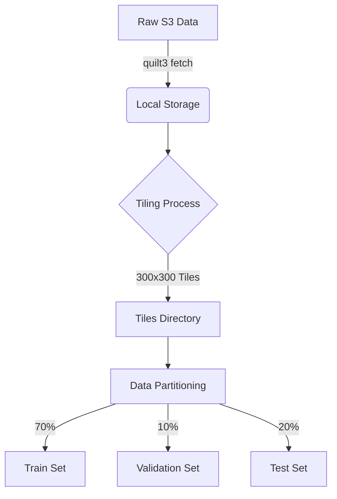
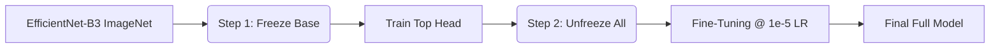
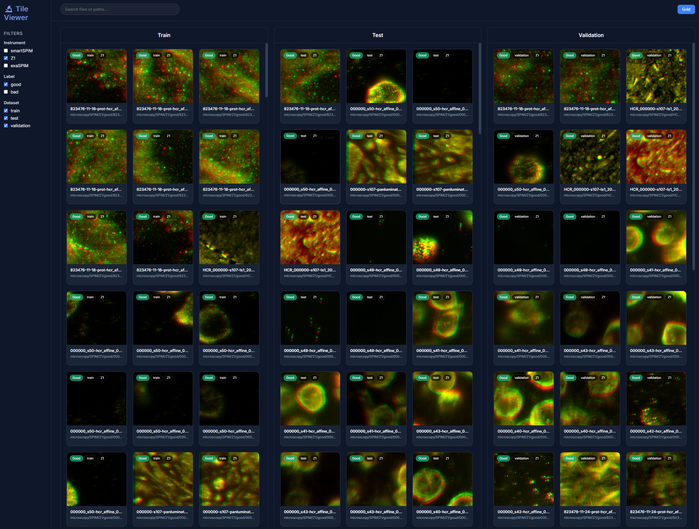
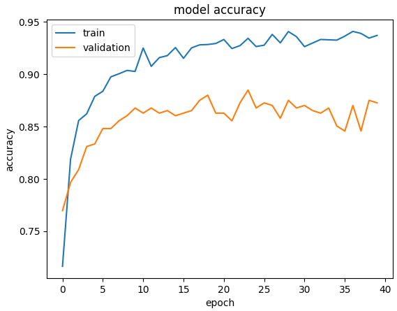
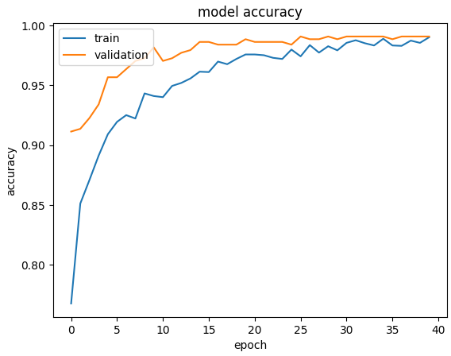
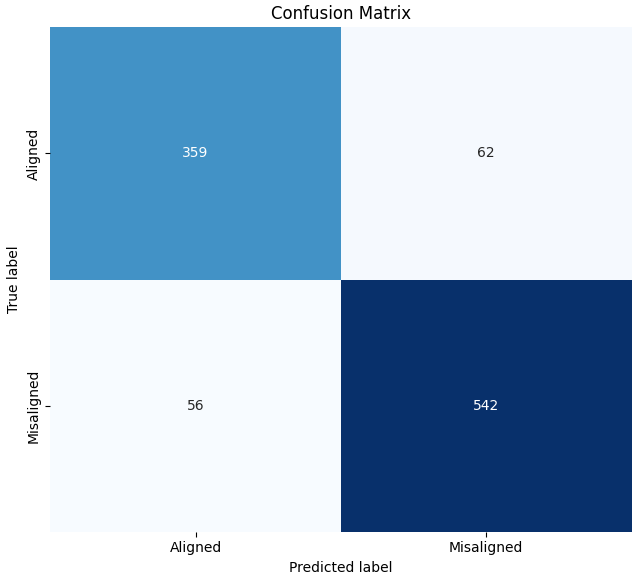
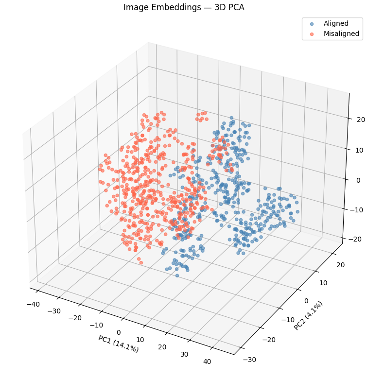

# Microscopy Stitch: Image Misalignment Detection


This repository contains a deep learning project dedicated to identifying misalignments in microscopic image stitching. Using **Keras** with a **JAX** backend, the project fine-tunes an **EfficientNet-B3** architecture to perform binary classification on high-resolution microscopy tiles.

## 🚀 Overview

Microscopic imaging often involves stitching multiple tiles together to form a large field of view. Misalignments during this process can lead to data artifacts. This project provides an automated classifier to detect these "bad" stitches, enabling quality control at scale.

### Key Features
- **EfficientNet-B3 Backbone**: Leverages pre-trained ImageNet weights for robust feature extraction.
- **JAX Backend**: High-performance execution on GPU/TPU.
- **Custom Data Pipeline**: Efficiently handles large microscopy datasets through tiling and lazy loading.
- **Two-Step Fine-Tuning**: Optimized training strategy for maximum accuracy.

---

## 🛠️ Project Structure

```text
Microscopy_Stitch_Classifier/
├── app/                # Web application for tile visualization
│   ├── public/         # Frontend assets (HTML, CSS, JS)
│   └── server.js       # Node.js backend
├── data/               # Raw microscopy data (fetched from S3)
├── datasets/           # Processed datasets and CSV labels
├── models/             # Saved Keras models (.keras)
├── notebooks/          # Experimentation and training logic
│   └── Images_Misalignment_Classifier.ipynb
├── tiles/              # Generated image tiles (300x300)
├── requirements.txt    # Python dependencies
└── README.md           # Project documentation
```

---

## 🔬 The Experiment Workflow

The core logic is contained in the `Images_Misalignment_Classifier.ipynb` notebook. The process follows a standard deep learning pipeline for computer vision.

### 1. Data Preparation
Images are fetched using `quilt3` from the Allen Institute's public scratch data. Since microscopy images can be extremely large, they are sliced into **300x300 tiles** to match the input requirement of EfficientNet-B3.

The dataset is partitioned using a **70/10/20** split for training, validation, and testing, respectively. This ensures a robust evaluation of the model's performance on unseen data.

### 2. Training Strategy
We employ a two-step fine-tuning approach to adapt the pre-trained model to the specific textures of microscopic imagery.

#### Step A: Feature Extraction
The EfficientNet-B3 base is frozen, and only the new classification head (GlobalAveragePooling + BatchNormalization + Dropout + Dense Sigmoid) is trained.

#### Step B: Full Fine-Tuning
The entire model is unfrozen and trained with a significantly lower learning rate (`1e-5`) to fine-tune the convolutional filters without destroying pre-trained knowledge.

### Mermaid Flowcharts

#### Data Pipeline Flow


#### Training Workflow


---

## 🖼️ Tile Viewer Application



This repository includes a web-based **Microscopy Tile Viewer** designed to browse, filter, and cross-reference the generated image tiles. The application provides a visual interface for quality control and dataset analysis.

### Features
- **Dataset Splitting**: View tiles in side-by-side tabs organized by category (Train, Validation, Test).
- **Dynamic Filtering**: Filter images by instrument (Z1, exaSPIM, smartSPIM), classification labels (Good/Bad), and dataset.
- **Cross-Referencing**: Click on a tile to highlight and automatically scroll to the same image in other dataset categories, helping track duplicates or leakage.
- **Visual Tags**: Instant visual cues for image quality and instrument origin.
- **Lightbox Inspection**: Full-screen image inspection with metadata overlay.

### Getting Started
To run the tile viewer locally:

1. Navigate to the application directory:
   ```bash
   cd app
   ```
2. Install dependencies:
   ```bash
   npm install
   ```
3. Start the server:
   ```bash
   npm start
   ```
4. Open your browser at `http://localhost:3000`.

---

## 📈 Performance & Analysis

The model's performance was evaluated during both stages of the fine-tuning process. The following visualizations demonstrate the convergence and the quality of the learned representations.

### 1. Fine-Tuning Metrics
The training process shows consistent improvement in accuracy and loss. The two-step approach allows for stable initialization followed by precise adaptation.

| Stage 1: Binary Head | Stage 2: Full Fine-Tuning |
|:---:|:---:|
|  |  |

### 2. Confusion Matrix
The final evaluation on the test set reveals high precision and recall for detecting misaligned image tiles.



### 3. Image Embeddings
To further validate the model, we extracted embeddings from the final global average pooling layer and visualized them using dimensionality reduction. The clear separation between "Aligned" and "Misaligned" tiles confirms that the model has learned meaningful features specific to microscopy artifacts.



---


## 📦 Requirements

Install the necessary libraries via pip:

```bash
pip install -r requirements.txt
```

**Key Dependencies:**
- `keras`, `keras-cv`, `keras-hub`
- `jax[cuda13]` (for high-performance GPU execution)
- `quilt3` (data versioning and retrieval)
- `Pillow`, `matplotlib`, `pandas`, `scikit-learn`

---

## ✍️ Authors & Contributions
- **Jerome MASSOT** - Initial research and implementation.
